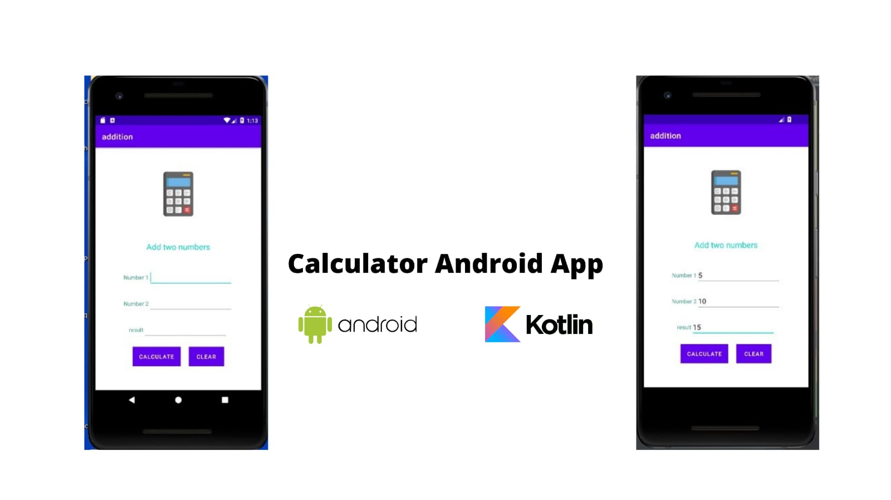

## Calculation app using kotlin
 

  

<h2> What is Kotlin? :</h2> 
  

Kotlin is designed to run on a Java Virtual Machine and can run side by side with Java. Although Kotlin first started as a language for Android development specifically, it quickly spread through the Java community because of its features and has since been used for many types of applications.

 
  

<h2> About this project : </h2>
  

Calculator app is made using kotlin language.
This is a simple app that performs calculation like addition, subtraction, multiplication, division and clear operation.

  

## 📌 Tech Stack:
  

  

## 📌 Main Page:
  
<h2>App image</h2>
  

  

<h2>📌 Contact :</h2>
  

<a href="mailto:shrutidmishra2002@gmail.com">

 

© 2021 Shruti Mishra 
